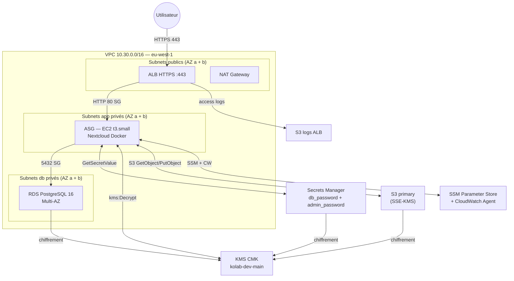

# RENDU - TP 05 - Nextcloud sur AWS

---

## Rappel critique — avant de zipper

> **Ne jamais committer** :
> - `*.tfvars` (sauf les `*.tfvars.example`)
> - `*.tfstate` et `*.tfstate.backup`
> - Le dossier `.terraform/`
> - Aucun mot de passe en clair (DB, admin Nextcloud, clé AWS, token GitHub)
> - Aucune clé privée (`*.pem`, `id_rsa`, etc.)
>
> Vérifiez une dernière fois avant le zip :
> ```bash
> cd tp05-nextcloud
> grep -rE "(password|secret|AKIA)" --include="*.tf" --include="*.tfvars" . | grep -v example
> # Doit retourner 0 ligne
> ```

---

## Section 1 — Identification de l'équipe

**Numéro d'équipe** : `1`
**Nom de code de l'équipe** *(optionnel)* : `GRP1`
**Date de rendu** : `2026-06-12`

### Membres

| Prénom Nom | Rôle assigné | Email | Compte GitHub |
|---|---|---|---|
| `Théo GRENET` | Platform Lead (Rôle 1) | `t.grenet@ecole-ipssi.net` | `@theogrenet` |
| `Ben Soualiho CHERIF` | Network Engineer (Rôle 2) | `bs.cherif@ecole-ipssi.net` | `@bensoualihocherif` |
| `Noura Aimee DOUVAWISSA` | Compute Engineer (Rôle 3) |`na.douvawissa@ecole-ipssi.net` | `@Dna-0324` |
| `Isaïé DONIES` | Data Engineer (Rôle 4) | `i.donies@ecole-ipssi.net` | `@isaie-dns` |
| `Julien RICHARD` | Security Engineer (Rôle 5) | `j.richard@ecole-ipssi.net` | `@VolgarIII`|

---

## Section 2 — Résumé architecture

**En 5 lignes maximum**, décrivez l'infrastructure déployée (couches, AZ, interactions principales).

VPC 10.30.0.0/16 sur eu-west-1, 6 subnets répartis sur 2 AZ (2 publics, 2 app privés, 2 db privés). Un ALB public expose Nextcloud en HTTPS (certificat self-signed) vers un ASG d'EC2 t3.small qui exécute Nextcloud en container Docker. RDS PostgreSQL 16 Multi-AZ en subnet privé db. Stockage objet sur S3 primary chiffré KMS CMK, logs ALB sur second bucket S3. Les secrets DB et admin sont générés et stockés dans Secrets Manager, lus par l'EC2 au démarrage via IAM Instance Profile (SSM + CloudWatch + Secrets Manager + KMS).

### Schéma Mermaid



---

## Section 3 — Arbitrages techniques réalisés

### Arbitrage 1 — Syntaxe Security Group AWS provider v5+

- **Choix retenu** : Ressources séparées `aws_vpc_security_group_ingress_rule` / `aws_vpc_security_group_egress_rule` pour chaque règle SG
- **Alternative envisagée** : Blocs `ingress`/`egress` inline dans `aws_security_group` (syntaxe v4)
- **Raison** : Le provider AWS v5 déprécie les blocs inline et peut créer des conflits lors des plans si les deux coexistent
- **Conséquence / limite** : Plus verbeux mais plus lisible et compatible long terme

### Arbitrage 2 — Résolution de la dépendance circulaire security ↔ data

- **Choix retenu** : La policy IAM d'accès S3 (`aws_iam_role_policy.app_s3_scoped`) est déclarée dans `envs/dev/main.tf` (Rôle 1), pas dans le module security
- **Alternative envisagée** : Passer les ARNs S3 en variables du module security et y déclarer la policy
- **Raison** : Le module security crée le rôle IAM, le module data crée les buckets S3 — chacun a besoin de l'output de l'autre pour créer la policy, ce qui forme une dépendance circulaire impossible à résoudre dans Terraform
- **Conséquence / limite** : La policy S3 est hors du module security, mais c'est le seul endroit cohérent architecturalement

### Arbitrage 3 — GitHub Actions via OIDC sans secret AWS

- **Choix retenu** : Provider OIDC GitHub + rôle IAM `sts:AssumeRoleWithWebIdentity` — aucun secret AWS stocké dans GitHub
- **Alternative envisagée** : Access key IAM (`AWS_ACCESS_KEY_ID` / `AWS_SECRET_ACCESS_KEY`) en secrets GitHub
- **Raison** : Les access keys statiques sont un risque de sécurité (rotation, fuite, durée de vie illimitée) ; OIDC émet des tokens éphémères scoped au repo et au workflow
- **Conséquence / limite** : Nécessite un `terraform apply` préalable du module `global/iam-github-oidc/` pour créer le provider OIDC et le rôle

---

## Section 4 — Retour sur les interfaces inter-modules

**Quelle interface a été la plus délicate à stabiliser ?**

L'interface entre le module `security` et le module `data` : le module security expose `app_iam_role_name` et le module data expose `s3_primary_bucket_arn`, mais pour créer la policy IAM S3 scoped il faut les deux simultanément, créant une dépendance circulaire. Résolu en déplaçant cette policy dans `envs/dev/main.tf`.

**Avez-vous dû modifier une interface en cours de route ? Si oui, laquelle et pourquoi ?**

Oui — les variables initiales du module security prévoyaient de recevoir les ARNs S3 en entrée. On a supprimé ces variables (`s3_primary_bucket_arn`, `s3_logs_bucket_arn`) du module security après avoir identifié la dépendance circulaire. Le module security ne connaît pas les buckets S3 ; c'est `envs/dev/main.tf` qui fait le lien.

**Qu'est-ce qui a le mieux fonctionné dans la collaboration inter-modules ?**

Le contrat d'interface (variables/outputs) défini au kick-off a permis à chaque rôle de travailler en isolation sans attendre les autres. Le Rôle 5 a pu développer et tester le module security de façon autonome en mockant les valeurs des autres modules, et le Rôle 1 a pu assembler `envs/dev/main.tf` dès que les outputs étaient connus.

**Qu'est-ce qui a bloqué ?**

La coordination sur `envs/dev/main.tf` en fin de journée : ce fichier centralise les appels à tous les modules et a nécessité les outputs de chaque rôle en même temps. La dépendance circulaire entre security et data a également retardé la finalisation des interfaces — elle n'avait pas été anticipée lors de la conception initiale.

---

## Section 5 — Résultats `terraform plan` et `terraform apply`

### `terraform plan` final

```
Plan: 22 to add, 1 to change, 0 to destroy.
```

### `terraform apply` final

```

module.compute.aws_lb.main: Still creating... [2m30s elapsed]

module.data.data.aws_secretsmanager_secret_version.db_password: Still reading... [2m30s elapsed]

╷

│ Error: modifying ELBv2 Load Balancer (arn:aws:elasticloadbalancing:eu-west-3:039497794217:loadbalancer/app/kolab-dev-alb-lill/31e9efb6ae40f59c) attributes: operation error Elastic Load Balancing v2: ModifyLoadBalancerAttributes, https response error StatusCode: 400, RequestID: 9757e65a-d049-452f-ad2d-42464cbef8d1, InvalidConfigurationRequest: Access Denied for bucket: kolab-dev-alb-logs-039497794217-heroic-macaque. Please check S3bucket permission

│ 

│   with module.compute.aws_lb.main,

│   on ../../modules/compute/alb.tf line 3, in resource "aws_lb" "main":

│    3: resource "aws_lb" "main" {

│ 

╵

╷

│ Error: reading Secrets Manager Secret Version (arn:aws:secretsmanager:eu-west-3:039497794217:secret:kolab-dev-db-password-IQOqJb|AWSCURRENT): couldn't find resource

│ 

│   with module.data.data.aws_secretsmanager_secret_version.db_password,

│   on ../../modules/data/rds.tf line 7, in data "aws_secretsmanager_secret_version" "db_password":

│    7: data "aws_secretsmanager_secret_version" "db_password" {

│ 

╵

╷

│ Error: putting S3 Bucket (kolab-dev-alb-logs-039497794217-heroic-macaque) Policy: operation error S3: PutBucketPolicy, https response error StatusCode: 400, RequestID: 78DWK5A462GPE84T, HostID: ySjGVrNp1rJIrirXtpwhuCM1mORwhpwLaZr0H0J2EC5Fgpn+f/U4W7oYjkEC6J0Xkp9F6Dv8opzTlsK6fgWyi3sRBKaq0m1a, api error MalformedPolicy: Invalid principal in policy

│ 

│   with module.data.aws_s3_bucket_policy.primary,

│   on ../../modules/data/s3.tf line 69, in resource "aws_s3_bucket_policy" "primary":

│   69: resource "aws_s3_bucket_policy" "primary" {
 
```
Trois erreurs sont apparues, toutes liées à un problème d'ordre de création (dépendances implicites mal gérées, ressources créées en parallèle trop tôt) :

Secrets Manager ... couldn't find resource — Le module data lisait le mot de passe DB via un data source avant que sa version soit écrite par le module security. Fix : remplacer le data source par une référence directe à l'output (sensible) du module security, qui force la dépendance.
Access Denied for bucket ... ALB logs — L'ALB tentait d'écrire ses logs avant que la bucket policy l'autorisant soit en place. Fix : ajout d'un depends_on pour que l'ALB attende la création de aws_s3_bucket_policy.logs.
PutBucketPolicy ... Invalid principal in policy — Le principal aws_elb_service_account (déprécié) résolvait mal. Fix : utiliser le service principal logdelivery.elasticloadbalancing.amazonaws.com dans la policy.

Cause racine commune : absence de dépendances explicites entre modules, d'où des erreurs intermittentes selon la vitesse de réponse d'AWS.


### Nombre total de ressources déployées

**Total** : `<!-- N -->` ressources

---

## Section 6 — Checklist des 5 screenshots obligatoires

Les captures doivent être dans `docs/screenshots/` au format PNG.

- [X] `01-plan-dev.png` — sortie de `terraform plan` avec `Plan: N to add, ...` visible
- [ ] `02-apply-success.png` — `Apply complete! Resources: N added.` + outputs visibles
- [ ] `03-nextcloud-login.png` — page de login Nextcloud dans le navigateur avec l'URL ALB visible
- [X] `04-file-in-s3.png` — console AWS S3 montrant un fichier uploadé avec le chiffrement KMS visible
- [X] `05-destroy-success.png` — `Destroy complete! Resources: N destroyed.`

---

## Section 7 — Coût estimé

| Ressource | Quantité | Prix unitaire (USD) | Sous-total 24h (USD) |
|---|---|---|---|
| EC2 t3.small | 1 | $0.023/h | $0.55 |
| ALB | 1 | $0.008/h + LCU | ~$0.20 |
| NAT Gateway | 1 | $0.045/h + data | ~$1.10 |
| RDS db.t3.micro Multi-AZ | 1 | $0.034/h | $0.82 |
| EBS RDS gp3 20 GB | 20 GB | $0.115/GB-mois | ~$0.08 |
| S3 primary + logs | < 1 GB (test) | $0.023/GB-mois | ~$0.01 |
| KMS CMK | 1 | $1.00/mois | ~$0.03 |
| Secrets Manager | 2 | $0.40/secret/mois | ~$0.03 |
| **Total 24h** | | | **~$2.82** |
| **Extrapolation 30 jours** | | | **~$84** |

**Méthode utilisée** : Estimation manuelle sur tarifs AWS eu-west-1 publics (juin 2025), hors free tier

**Commentaire** :

Le NAT Gateway représente le poste le plus coûteux en production (trafic data sortant). En vrai projet on envisagerait des VPC Endpoints S3/SSM pour éviter de faire transiter le trafic AWS par le NAT.

---

## Section 8 — Rétrospective équipe

### 3 choses qui ont bien marché

1. Le découpage en modules avec interfaces claires (variables/outputs) a permis de travailler en parallèle sans bloquer les autres rôles
2. L'authentification GitHub Actions via OIDC : zéro secret AWS dans GitHub, setup propre dès le départ
3. La stratégie de chiffrement centralisée (une seule CMK KMS partagée par S3, RDS et Secrets Manager) a simplifié la gestion des permissions et évité la multiplication des clés

### 3 choses qui ont bloqué

1. La dépendance circulaire entre le module security et le module data (policy IAM S3) — non détectée à la conception des interfaces
2. Les contraintes du compte de formation AWS (permissions_boundary obligatoire, région imposée eu-west-1) ne sont pas documentées dans le sujet — découvertes à l'exécution lors des erreurs IAM
3. La coordination sur `envs/dev/main.tf` : ce fichier est le point d'assemblage de tous les modules et nécessite les outputs de chaque rôle, ce qui en fait un goulot d'étranglement en fin de journée

### 3 améliorations pour la prochaine fois

1. Modéliser les dépendances entre modules sur un schéma avant d'écrire le code pour détecter les cycles en amont
2. Définir et geler les interfaces (variables.tf + outputs.tf) en tout premier, avant d'écrire la logique de chaque module
3. Documenter les contraintes de l'environnement cible (permissions_boundary, région, compte AWS) dans un CONTRIBUTING.md dès le kick-off pour éviter les découvertes tardives

---

## Section 9 — Contribution individuelle par rôle


---

### Rôle 1 — Platform Lead

**Membre** : Théo GRENET

**Ce que j'ai livré** :

- `bootstrap/` — script de création du bucket S3 backend + configuration initiale du compte
- `envs/dev/backend.tf` — backend S3 avec `use_lockfile = true`, chiffrement KMS
- `envs/dev/providers.tf` — provider AWS v5+, default_tags (Project/Environment/ManagedBy/Team)
- `envs/dev/variables.tf` — variables d'environnement avec validations (région, CIDR admin)
- `envs/dev/main.tf` — assemblage de tous les modules + policy IAM S3 scoped (pont security ↔ data)
- `envs/dev/outputs.tf` — 9 outputs exposés (alb_dns_name, nextcloud_url, db_endpoint, etc.)
- `envs/dev/terraform.tfvars.example` — exemple de variables pour l'équipe
- Revue et merge de toutes les PRs des Rôles 2-5 avec au moins 1 approval
- Orchestration du `terraform apply` collectif final

**Ce qui m'a surpris ou frustré** :

Le rôle de Platform Lead implique une dépendance forte sur les outputs de tous les autres rôles pour finaliser `envs/dev/main.tf`. En attendant les modules des autres, il est difficile de tester l'assemblage — le `terraform validate` ne peut passer qu'une fois tous les modules présents. La gestion des conflits de merge sur ce fichier central a également été plus complexe qu'anticipé.

**Ce que j'ai appris** :

La structure d'un projet Terraform multi-modules en équipe, la gestion du backend S3 avec `use_lockfile`, et l'importance de définir les interfaces (outputs) avant même d'écrire les ressources pour débloquer les dépendances en aval.

**Hash du dernier commit significatif** : `f6e23f6`

---

### Rôle 2 — Network Engineer

**Membre** : Ben Soualiho CHERIF

**Ce que j'ai livré** :

- `modules/networking/main.tf` — VPC 10.30.0.0/16, 6 subnets (2 publics, 2 app privés, 2 db privés) sur 2 AZ
- `modules/networking/main.tf` — Internet Gateway, NAT Gateway(s), route tables publiques et privées
- `modules/networking/variables.tf` — vpc_cidr, project_name, environment, availability_zones
- `modules/networking/outputs.tf` — vpc_id, vpc_cidr, public_subnet_ids, private_app_subnet_ids, private_db_subnet_ids
- `modules/networking/README.md` — documentation du module

**Ce qui m'a surpris ou frustré** :

La répartition des subnets sur plusieurs AZ est plus verbale en Terraform qu'attendu — il faut itérer sur les AZ avec `count` ou `for_each` et calculer les CIDRs avec `cidrsubnet()`. La fonction `cidrsubnet()` n'est pas intuitive au premier abord.

**Ce que j'ai appris** :

La conception d'une architecture réseau AWS à 3 couches (publique / app / db), le fonctionnement du NAT Gateway (sortie internet pour les subnets privés sans exposition directe), et l'utilisation de `cidrsubnet()` pour découper automatiquement les plages d'adresses.

**Hash du dernier commit significatif** : `6683842`

---

### Rôle 3 — Compute Engineer

**Membre** : Noura Aimee DOUVAWISSA

**Ce que j'ai livré** :

- `modules/compute/alb.tf` — ALB public, target group, listener HTTPS :443 (certificat self-signed), redirection HTTP→HTTPS
- `modules/compute/asg.tf` — Launch Template + Auto Scaling Group, instance type t3.small, IMDSv2 obligatoire
- `modules/compute/asg.tf` — association de l'instance profile IAM (Rôle 5) au Launch Template
- `modules/compute/templates/nextcloud-user-data.sh.tftpl` — script de démarrage : installation Docker, démarrage Nextcloud, récupération des secrets depuis Secrets Manager
- `modules/compute/variables.tf` — vpc_id, subnet_ids, alb_sg_id, app_sg_id, instance_profile_name, db_endpoint, secrets ARNs, kms_key_arn
- `modules/compute/outputs.tf` — alb_dns_name, nextcloud_url, asg_name
- `modules/compute/README.md` — documentation du module

**Ce qui m'a surpris ou frustré** :

Le script user-data est difficile à déboguer sans accès SSH direct à l'instance (qui est en subnet privé). Il faut utiliser SSM Session Manager pour se connecter et consulter `/var/log/cloud-init-output.log`. La dépendance sur les outputs du Rôle 4 (db_endpoint) et du Rôle 5 (instance_profile_name, secrets ARNs) a aussi retardé la finalisation du module.

**Ce que j'ai appris** :

La configuration d'un ALB avec listener HTTPS et certificat auto-signé via Terraform, le fonctionnement des Launch Templates avec IMDSv2, et la récupération de secrets AWS depuis un script bash au démarrage de l'instance via `aws secretsmanager get-secret-value`.

**Hash du dernier commit significatif** : `211700c`

---

### Rôle 4 — Data Engineer

**Membre** : Isaïé DONIES

**Ce que j'ai livré** :

- `modules/data/rds.tf` — RDS PostgreSQL 16, instance db.t3.micro, Multi-AZ, chiffrement KMS, subnet group db privé
- `modules/data/s3.tf` — bucket S3 primary (stockage Nextcloud) : SSE-KMS CMK, versioning, lifecycle
- `modules/data/s3.tf` — bucket S3 logs (logs ALB) : SSE-S3, ACL log-delivery, politique de rétention
- `modules/data/variables.tf` — vpc_id, db_subnet_ids, kms_key_arn, project_name, environment, db_password
- `modules/data/outputs.tf` — db_endpoint, db_name, db_port, s3_primary_bucket_arn, s3_primary_bucket_name, s3_logs_bucket_name
- `modules/data/README.md` — documentation du module

**Ce qui m'a surpris ou frustré** :

RDS Multi-AZ avec chiffrement KMS impose que la CMK soit créée avant l'instance RDS — la dépendance sur le module security est donc forte et bloquante. Par ailleurs, le bucket S3 de logs ALB nécessite une ACL spécifique (`log-delivery-write`) et une policy bucket autorisant le service ALB à écrire, ce qui n'est pas documenté de façon évidente.

**Ce que j'ai appris** :

La configuration RDS avec subnet group et chiffrement at-rest via KMS CMK, la mise en place du versioning S3 et des lifecycle rules, et la différence entre chiffrement SSE-KMS (CMK gérée) et SSE-S3 (clé AWS gérée) selon le niveau de contrôle souhaité.

**Hash du dernier commit significatif** : `bc9b6f5`


---

### Rôle 5 — Security Engineer

**Membre** : Julien RICHARD

**Ce que j'ai livré** :

- `modules/security/sg.tf` — 3 Security Groups (alb, app, db) avec règles `aws_vpc_security_group_ingress_rule` / `_egress_rule` (syntaxe AWS provider v5+), isolation SG-to-SG pour app et db
- `modules/security/kms.tf` — CMK + alias `alias/kolab-dev-main`, rotation annuelle activée, key policy 3 statements (root + app role + services via IAM)
- `modules/security/iam.tf` — IAM role EC2 + instance profile + 2 policies inline scopées (Secrets Manager + KMS) + attachments SSM/CloudWatch, `permissions_boundary` appliquée
- `modules/security/secrets.tf` — 2 secrets générés via `random_password` (db_password 24c, admin_password 20c), chiffrés KMS, `recovery_window_in_days = 0` en dev
- `modules/security/README.md` — documentation avec marqueurs terraform-docs
- `.pre-commit-config.yaml` — hooks qualité : fmt, validate, tflint, tfsec, terraform-docs, detect-private-key
- `.github/workflows/terraform-plan.yml` — CI/CD GitHub Actions : plan automatique sur PR via OIDC (aucun secret AWS stocké dans GitHub)
- `global/iam-github-oidc/` — provider OIDC GitHub + rôle IAM `ReadOnlyAccess` pour GitHub Actions

**Ce qui m'a surpris ou frustré** :

La dépendance circulaire entre les modules security et data n'était pas évidente au départ — on s'attend naturellement à mettre toutes les policies IAM dans le module security. Comprendre qu'il faut casser le cycle en remontant la policy dans `envs/dev/main.tf` a demandé de revoir la conception. Également, le `permissions_boundary` imposé par le compte de formation n'est pas documenté dans le TP mais est bloquant sans lui.

**Ce que j'ai appris** :

La syntaxe AWS provider v5+ pour les Security Groups (ressources séparées vs blocs inline), la mise en place d'une authentification OIDC GitHub Actions sans access key, la structure d'une key policy KMS à 3 statements (root / rôle applicatif / services via IAM), et la résolution de dépendances circulaires Terraform en déplaçant les ressources "pont" au niveau de l'environnement.

**Hash du dernier commit significatif** : `6be8a27`

---

## Section 10 — Checklist finale avant remise

- [X] `terraform destroy` exécuté avec succès (`05-destroy-success.png` le prouve)
- [X] Console AWS vérifiée : aucune EC2, RDS, NAT Gateway, ELB, EIP, Secrets Manager, bucket S3 résiduel avec les tags de l'équipe
- [X] Aucun `*.tfstate` ou `*.tfstate.backup` dans le zip
- [X] Aucun dossier `.terraform/` dans le zip
- [X] Aucun `*.tfvars` personnel (seul `terraform.tfvars.example` autorisé)
- [X] Aucun secret en clair dans le code
- [X] `grep -rE "(password|secret|AKIA)" --include="*.tf" . | grep -v example` retourne 0 ligne
- [ ] Les 5 screenshots sont dans `docs/screenshots/`
- [X] `docs/RENDU.md` est rempli à 100 % — plus aucun `<!-- remplir -->` ni `TODO` résiduel
- [X] `ARCHITECTURE.md` contient un schéma Mermaid à jour
- [X] Chaque module dans `modules/` a son `README.md`
- [X] `.terraform.lock.hcl` est committé
- [X] Commits git tracés par auteur
- [X] Zip nommé `tp05-nextcloud-equipe<N>.zip`

### Commande de packaging recommandée

```bash
# Nettoyage des artefacts
find tp05-nextcloud -type d -name ".terraform" -exec rm -rf {} +
find tp05-nextcloud -name "terraform.tfstate*" -delete
find tp05-nextcloud -name "*.tfvars" ! -name "*.tfvars.example" -delete

# Vérification finale secrets
grep -rE "(password|secret|AKIA)" tp05-nextcloud --include="*.tf" --include="*.tfvars" | grep -v example

# Zip
zip -r tp05-nextcloud-equipe<N>.zip tp05-nextcloud/
```

---

## Signature de l'équipe

**Date de remise** : `2026-12-06 17:20`

- [x] Isaïé DONIES (Rôle 1) — certifie l'exactitude des informations ci-dessus
- [x] Ben Soualiho CHERIF (Rôle 2) — certifie l'exactitude des informations ci-dessus
- [x] Noura Aimee DOUVAWISSA (Rôle 3) — certifie l'exactitude des informations ci-dessus
- [x] Théo GRENET (Rôle 4) — certifie l'exactitude des informations ci-dessus
- [x] Julien RICHARD (Rôle 5) — certifie l'exactitude des informations ci-dessus
